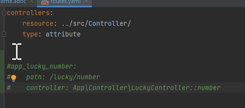
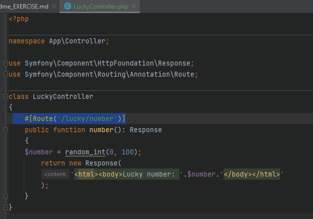
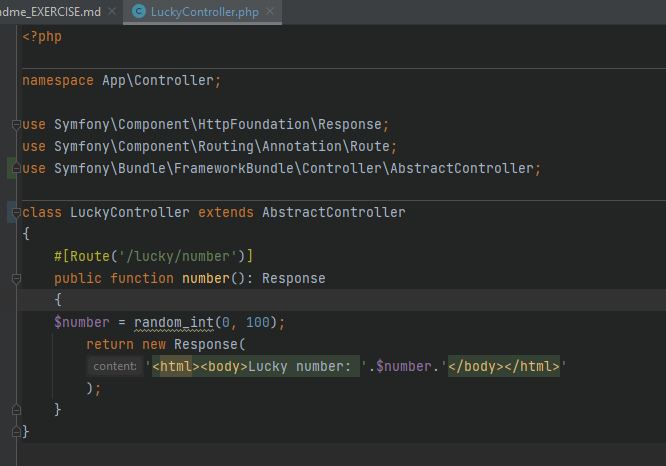
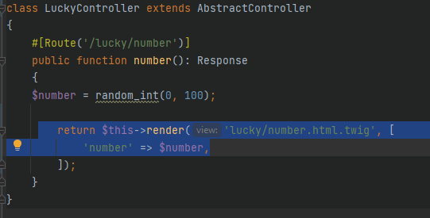
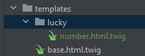
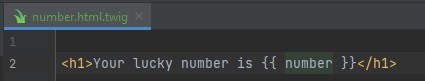

SYMFONY

== Installatie: +
https://symfony.com/download

=== Stap 1:
Kies op welke manier je wenst te installeren
 Binaries: amd64 =&gt; zipfile

(Een binair bestand is een computerbestand waarin elke positie alle denkbare bitcombinaties kan bevatten (256 verschillende bij gebruik van een 8-bitscodering).

=== Stap 2:
De zipfile dient uitgepakt te worden en deze uitgepakte bestanden dienen in een gewenste map** gestoken te worden.
** C:\Program Files\Symfony

De map Symfony maken we nieuw aan en de geopende bestanden kopiëren we naar hier

=== Stap 3:
Command doorgeven in terminal: $ symfony -v

Start oefening: 

 Command : `symfony new YOUR_PROJECT_NAME --web-app`

 Project wordt aangemaakt op de plaats waar je je command hebt ingevoerd

Don't forget to create a vhost for this project!

 <VirtualHost *:80>
 ServerName domain.tld
 ServerAlias www.domain.tld

----
 DocumentRoot /var/www/project/public
 <Directory /var/www/project/public>
     AllowOverride All
     Order Allow,Deny
     Allow from All
 </Directory>
----

</VirtualHost>

Nu eerst wat leren op de site van Symfony
Bij het opstarten van een project dient eerst de server te worden opgezet. Voor onze oefening is dit niet nodig.

== oefening:
https://symfony.com/doc/current/page_creation.html

=== Creating a page: Route and Controller
- Create a "Controller" class and a "controller" method (a function where you build the page and
ultimately return a Response object) inside of it.

- associate this controller function with a public URL, so the method is called when a user browses to it.
This association is defined by creating a route in the config/routes.yaml file.

OR

Use annotation Routes
Instead of defining your route in YAML, Symfony also allows you to use annotation or attribute routes.
Attributes are built-in in PHP starting from PHP 8.
In earlier PHP versions you can use annotations. To do this, you need to install the annotations package:

 composer require annotations

=== The bin/console Command
This is a buil-in debugging tool.

- If you run the command " php bin/console", You see a list of commands that can give you debugging information,
help generate code, generate database migrations and a lot more...

- To get a list of all of the routes in your system, use the debug:router command:

 php bin/console debug:router

=== Rendering a template
If you're returning HTML from your controller, you'll probably want to render a template.
Fortunately, Symfony comes with Twig: a templating language.
https://twig.symfony.com/

- Install the twig package with:

 composer require twig

- Make LuckyController extends Symfony's base AbstractController class:

- Use the handy render() method to render a template. Pass it a number variable so you can use it in Twig:

- Create a new templates/lucky directory with a new number.html.twig file inside:
(Template files live in the templates/ directory, which was created for you automatically when you installed Twig.)

The {{ number }} syntax is used to print variables in Twig

